# Library window (presentation)

## Structure

| Piece | Where | Role |
| --- | --- | --- |
| Composition root | `main.cpp`, `src/app/libraryroot.*`, `src/app/librarymemory.*` | Resolves the library folder, creates the `LibraryController`, gives it the SDK metadata extractor (`sdk::SdkMetadataExtractor`), contents analyzer and bookmark writer (`sdk::SdkBookExporter`) and whether OCR models were found, passes it to `Main.qml` as the required property `library`, and opens the library. It tells the `LibrarySwitcher` the default folder (`app::defaultLibraryRoot`) and how this library was chosen. With `--existing-library`, and for the **remembered** library (`app::LibraryMemory`, the setting `library/last`), it opens only an existing library (`openExisting`), never creating one. With `--remember`, `app::rememberWhenOpened` stores the library once it is Ready, and never if it fails. |
| `LibraryController` | `src/presentation/librarycontroller.*` | The library session. It opens the library (lock, migrations, `ImportService::recover`) and imports files on a **one-thread worker pool**. It delivers progress (throttled to about 10 updates a second) and per-file results through queued invocations, and reloads the book list through `QFuture::then(this, …)`, so models change only on the GUI thread. |
| `LibraryController` and processing | same | Once the library is open, it creates the `ProcessingCoordinator` (docs/PROCESSING.md), runs job recovery, and then starts it. Coordinator signals update the models on the GUI thread: `jobChanged` updates one row, and `metadataPublished` reloads the book list. `refresh()` loads the books, each book's latest job (`catalog::latestJobs`, one window-function pass), the 100 most recent jobs and **every open job** in one database task. Refreshes are coalesced: one runs at a time, and calls made meanwhile schedule a single further one. |
| `BookListModel` | `src/presentation/booklistmodel.*` | GUI-owned list of copied `BookSummary` values. Roles: `bookId`, `title`, `titleFromFileName`, `contributors`, `processingState`. The processing state combines what the catalog holds with the book's latest metadata job. |
| `JobListModel` | `src/presentation/joblistmodel.*` | GUI-owned activity list, newest first, capped at 200 finished rows. Roles: `jobId`, `bookId`, `bookTitle`, `kindText`, `state`, `stateText`, `detail`, `running`, `canCancel`, `canRetry`. Properties: `pendingCount` and a one-line `summary`. Updates older than the row shown (by `updatedAt`) are ignored, so a late snapshot cannot undo a newer state. |
| `BookInspector` | `src/presentation/bookinspector.*` | The selected book, loaded on the database thread: effective metadata with where each value came from, the evidence and candidates behind it (at most five candidates, then a count), and the contents summary and notes. Loads are tagged, so only the newest selection or reload is applied. It reloads after each book-list refresh, and rebuilds the tree only when the contents changed (a new run, or an edited revision saved, kept or discarded), so expanded branches and the current entry survive other updates. It carries the metadata corrections (M07 part 1) and the contents edits (part 2b), each checked before saving; a contents edit also carries the run and revision on screen, so a stale one is refused and the contents are reloaded. |
| `TocTreeModel` | `src/presentation/toctreemodel.*` | The **catalog's** contents as a tree (never the PDF's own bookmarks). It is built in two passes, so a parent may be listed after its child. A missing parent, a self-reference or a cycle keeps the entry at the top level with the note "parent not found"; an entry below a cycle member stays attached; Unknown hierarchy stays at the top level. Roles: title, page text, physical page (index + 1), source page, printed label, state text, uncertain, in plan, plain-language details, technical details, removed, and what the user changed. A page or level the user set replaces the analysis's reasons for it. `indexOfEntry(key)` finds an entry again after a rebuild. |
| `BookInspectorPane.qml` | `qml/inspector/` | The inspector: title and file, then two tabs. **Title and authors** shows each field's value and source; a field without a value shows the analysis's reason under it, and a button named for what it reveals ("Show candidates (*n*)", "Show evidence") shows the rest. There is no button when there is nothing more. **Contents** shows the summary, short notes (counts such as "No page found: 17 of 221"), **Analysis notes (*n*)** for the analysis's own reasons (on request, in a scrolling popup over the pane, so a long list never moves the tree, whatever the window's size), a banner for edited contents, the tree, and the selected entry's reasons and edit actions. Corrections and edits open dialogs; all changes go through `BookInspector`. |
| `SearchController`, `SearchResultsModel` | `src/presentation/search*` | The search field: debounced, newest request wins, paginated, re-run after catalog changes. See SEARCH.md, "In the application". |
| `SearchResultsView.qml` | `qml/search/` | Results: book, how it matched, its processing state, and chapter hits with the physical page, or "Page not found" and where it is listed. Choosing a result shows the book in the inspector. |
| `ReaderController` | `src/reader/readercontroller.*` | The reading session: the open book, the document, the requested and shown pages (physical indices), and the saved reading position. It owns document lifetime; see READER.md, "The embedded reader". |
| `ReaderPane.qml` | `qml/reader/` | The reader: "Library" (back), title, previous and next page, an editable page number "of *n*", and the PDF. |
| `CollectionListModel` | `src/presentation/collectionlistmodel.*` | The collections for the sidebar, by name, with active book counts. Roles: `collectionId`, `name`, `bookCount`. Unchanged rows keep their state across refreshes. |
| `LibrarySidebar.qml` | `qml/library/` | The views: **Library (*n*)**, each collection (*n*), and **Trash (*n*)**; **New collection…**, and Rename… / Delete… on a collection (right-click, press and hold, the Menu key or Shift+F10; F2 renames, Delete asks to delete). Names are plain text. Refusals (a duplicate name) are shown under it. |
| `ExportController` | `src/presentation/exportcontroller.*` | The Export dialog's session (M09). `prepare(book)` loads on the database thread what the copy will get: the number of bookmarks, a summary, one note per entry left out or moved with the reason, a suggested "*title* (bookmarked).pdf" in Documents, and the book's last export. `exportTo(path)` asks the `ProcessingCoordinator` for the copy and follows its job: Waiting (behind an analysis), Writing, Cancelling, then Saved, NotSaved or Cancelled. A file already at the destination moves to **NeedsReplace**; only `confirmReplace()` replaces it. A refusal shows the coordinator's reason (inside the library folder, a protected file, a book in Trash). |
| `ExportDialog.qml` | `qml/export/` | "Save a copy with bookmarks", from the inspector's **More** menu. It shows the preview (scrolling when the window is small, so the path, progress and buttons stay visible), a "Save as" field with **Choose…** (a native save dialog whose own overwrite prompt is off, so replacing is always confirmed here), the progress and the result, **Show folder** once saved, and **Cancel saving**. Closing it does not stop a copy being saved; the job queue shows it, and opening the dialog again for that book follows the same copy (progress, result, Cancel). |
| `BackupController` | `src/presentation/backupcontroller.*` | Back up… and Restore… (M10), owned by `LibraryController` as `backup`. `backUp(folder)` and `restore(backup, target)` run `storage::createBackup` / `restoreBackup` on the controller's own one-thread pool. Progress (files copied) and the result come back through queued calls, as plain-language `statusText` with `succeeded` and `resultFolder`. Restore protects the open library's folder. A running backup or restore makes the library session **busy**: closing the window cancels it and waits, and nothing half-made is left. `openRestoredLibrary()` starts MyBooksLibrary on the restored library in a new window, with `--existing-library --remember`. |
| `BackupDialog.qml` | `qml/backup/` | From the toolbar's **Backup** menu: "Back up the library…" (a folder, Documents by default) or "Restore a backup…" (a backup folder, and a new folder "MyBooksLibrary restored *date*"). It shows a progress bar and the result, with **Show folder**, **Open restored library**, and **Cancel** while it runs. |
| `LibrarySwitcher` | `src/presentation/libraryswitcher.*` | Which library this window holds, and opening another (issue #30), owned by `LibraryController` as `switcher`. It gives the window's title (`currentName`), the toolbar's tooltip (`currentPath`, `sourceText`) and `currentIsDefault`. `openFolder(folder, newWindow)` checks the folder on its own one-thread pool with `catalog::Library::checkExisting` (an existing library, not a backup) and refuses the library this window holds (real paths, A1's `isInsideFolder`). Then it starts a **new process** with `--library <folder> --existing-library --remember`. `openDefault(newWindow)` starts the default library, which may be created there, with `--remember`. Refusals are in `error`; a start emits `started(newWindow, folder)`. The launcher is replaceable for tests. |
| `OpenLibraryDialog.qml` | `qml/library/` | From the toolbar's **Library** menu (Open library…, after a folder dialog, and Open the default library), or from the notice shown when this window's library could not be opened. It shows the folder, **New window** or **Instead of this library**, the check in progress and any refusal. "Instead" asks the window to close through its normal closing flow once the new process has started. |
| `BookListView.qml` | `qml/library/` | The book list of the current view. The selection is kept by book ID across every row change (not only resets), so the list and the inspector always show the same book, or none. |
| `Main.qml` | repository root | The list-first window. QML only reads properties and calls `importUrls`, `cancelImports`, `refresh`, `cancelJob`, `retryJob`, `cancelAllJobs` and `prepareToClose`, and the switcher's `openFolder`, `openDefault` and `clearError`. There is no SQL, file or SDK work in QML. The title names the library ("*folder* – MyBooksLibrary"). When the library could not be opened, a notice gives the reason (`openError`) with **Open library…** and **Open the default library**. |

`mbl_presentation` is a static QML module (`MyBooksLibrary.Presentation`), so `Main.qml` uses typed `LibraryController`/`BookListModel` and `qmllint` checks its member accesses. Both types are uncreatable from QML.

## Theme

The window uses the **FluentWinUI3** style (Qt 6.8+), set in `qtquickcontrols2.conf`, which is built into the app's resources. Qt's default on Windows is the older "Windows" style, which the app used until the UI overhaul.
- **Light and dark:** as chosen in the Appearance dialog; by default, as Windows is set. `--color-scheme light|dark` (development) overrides it for screenshots and checks.
- **Who overrides it:** `QT_QUICK_CONTROLS_STYLE` and `-style` take precedence over the configuration file. The QML tests set `Basic`, because the native styles need a real window.
- **Fusion fallback:** FluentWinUI3 falls back to Fusion for the controls it does not cover, such as `SplitView`'s handles. The package ships both styles, since `windeployqt` deploys every Qt Quick Controls style.

**`Theme`** (`qml/theme/Theme.qml`, a singleton in `MyBooksLibrary.Presentation`, so every view and QML test can use it) holds the views' shared values. Views use these roles instead of fixed colours, opacities and pixel sizes. Colours the palette already provides (text, window) come from the palette. The accent is `Theme.accent`, which the window also sets as `palette.accent`, so the style's controls and popups use it too.

| Group | Roles | Values |
| --- | --- | --- |
| Type ramp | `captionSize`, `bodySize`, `bodyLargeSize`, `subtitleSize`, `titleSize`, `headingWeight` | Fluent's 12 / 14 / 18 / 20 / 28 px. A larger application font scales them up, and they never go below Fluent's. Headings are DemiBold |
| Spacing and shape | `spacingXS`…`spacingXL` (4, 8, 12, 16, 24), `controlRadius` (4), `cardRadius` (8) | A 4 px grid |
| Text | `textSecondary` | WinUI's secondary text: labels, sources, counts. Never made fainter with opacity |
| Status | `critical`, `success`, `caution` | WinUI's status colours, light and dark, always with words. The light caution is darkened to `#8a5000`, because WinUI's `#9d5d00` reaches only 4.4:1 on a selected row |
| Accent | `accent`, `tint(alpha)` | The Appearance choice for the current scheme (`Appearance.accentLight` / `accentDark`) |
| Surfaces | `selectedFill`, `selectionBarWidth`, `paneTint`, `barTint`, `cardFill`, `cardStroke`, `divider` | A selected row the view draws itself (an accent tint), the sidebar and the toolbars (lighter accent tints), cards and dividers. In light the tints are 5% at most, the most that keeps the status colours at 4.5:1 |

**Selected rows:**
- Lists use the style's own selection: a subtle fill and an accent bar. The text keeps its colour, and views never use `palette.highlightedText`, which would be white on light grey under Fluent.
- The contents tree draws its current row itself, with `selectedFill` (a faint accent tint) and an accent bar. Its fill is therefore slightly coloured, where the lists' Fluent fill is neutral grey; both have the accent bar.

**Panes:** the `SplitView`'s handle is a thin `divider` line with a 7 px grab area. It turns into a 3 px accent line on hover or drag. Fusion's own handle is a thick bar.

**The contents entry's details:** a card (`cardFill`, `cardStroke`) at most half the Contents tab high. Its contents scroll inside it, so a long list of reasons or actions never pushes it under the status bar.

Screenshots of PR 1, at the default size (1100×720) on a scratch library with the test fixtures:

| Before (the "Windows" style) | Light | Dark |
| --- | --- | --- |
| 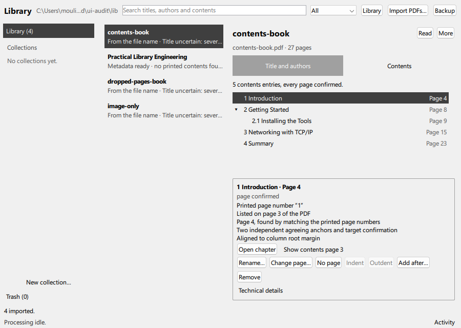 | 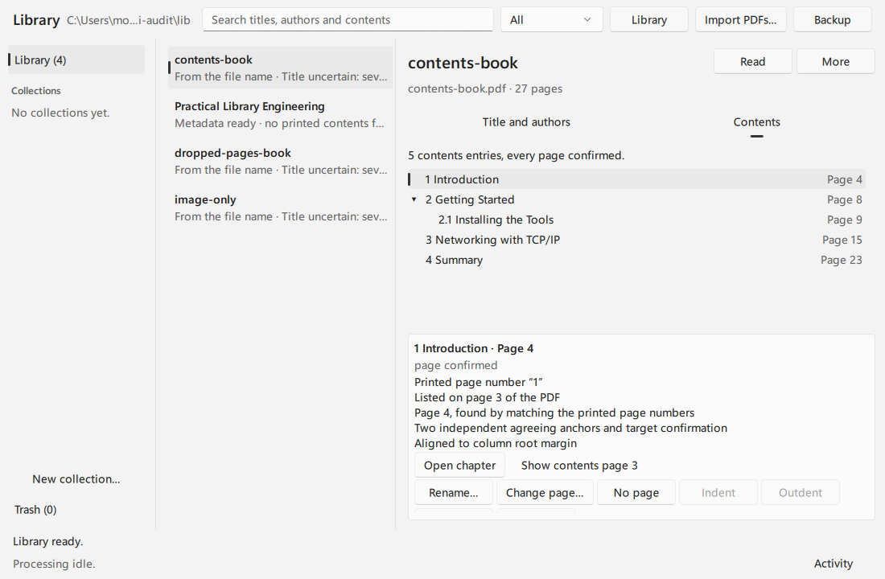 | 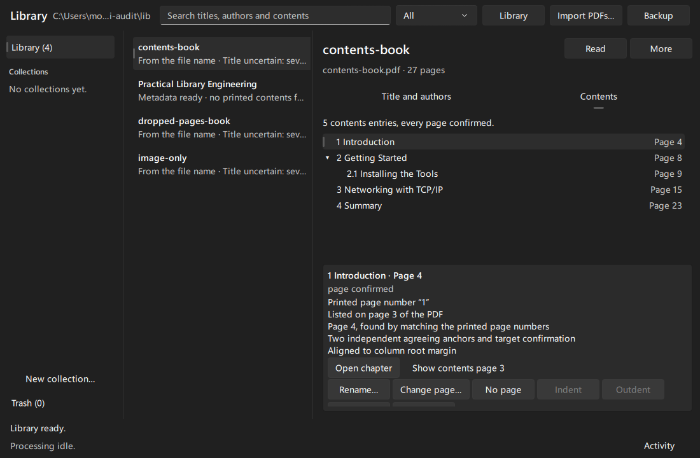 |

`images/ui1-fluent-style-only.png` shows FluentWinUI3 without these changes. The selected book is white on light grey there, and the contents details run under the status bar.

### Appearance: theme and accent

Inspired by [repo-watch](https://github.com/PantaKoda/repo-watch)'s Appearance settings (theme System/Light/Dark, a few restrained accent presets, status colours that never follow the accent, accent-tinted panels).

- **`Appearance`** (`src/presentation/appearance.*`, a QML singleton in `MyBooksLibrary.Presentation`): `theme` (`System`, `Light`, `Dark`), `accent` (a preset id), `accents` (id, name, light and dark colour) and `accentLight` / `accentDark`.
  - **Theme** sets `QStyleHints::setColorScheme` (System unsets it), which Fluent and `Theme.dark` follow.
  - **Accents:** Lapis blue (default), Teal, Violet, Rose, Graphite, and Windows accent (the system palette's, updated when Windows changes it). Each preset has a light-scheme colour that carries Fluent's white accent-button text and a dark-scheme colour that carries its black text, both at 4.5:1 or more, and 3:1 on the window as a selection bar. No preset uses the status hues (red, green, amber).
  - **Stored** in QSettings, `appearance/theme` (`system`, `light`, `dark`) and `appearance/accent`. Only known values are honoured; a hand-edited one falls back to the default, as repo-watch does.
  - **One instance:** `main.cpp` makes it with `Appearance::fromArguments` and registers it with `setInstance` before the engine loads; QML's `create()` returns it. The class has no default constructor, so QML never makes its own. Without an instance (tests), each engine gets one that stores nothing. Only the registered instance watches for a change of Windows' accent (one application event filter).
  - **Development:** `--color-scheme` and `--accent <id>` show the window that way; with either, the stored choice is neither read nor written. An unknown accent id prints `warning=unknown --accent …` with the valid ids.
  - **`accents` changes only with Windows' accent,** not with the choice, so the dialog's swatches are not rebuilt on every click.
- **`AppearanceDialog.qml`** (`qml/theme/`), from the toolbar's round **Appearance** button (a ring and dot in the accent): the theme as three radio buttons in a row, the accents as colour dots (a ring marks the chosen one, a ring in the text colour marks keyboard focus, the name is in the tooltip and under the dots). The dots are not checkable buttons: the choice alone decides the ring, so clicking the chosen dot again keeps it chosen. Assistive technology reads them as radio buttons, checked for the chosen one. Choices apply at once.
- **Where the accent shows:** selection bars (lists, the contents tree, tabs), the contents tree's selected row (`selectedFill`), focus and checked controls, the two main actions as accent buttons (**Import PDFs…**, **Read**), and a light tint on the toolbar, the status bar (`barTint`) and the sidebar (`paneTint`).

| Before (Windows' grey accent) | Light, Lapis blue (default) | Dark, Violet | Dark, Teal | Appearance dialog |
| --- | --- | --- | --- | --- |
| 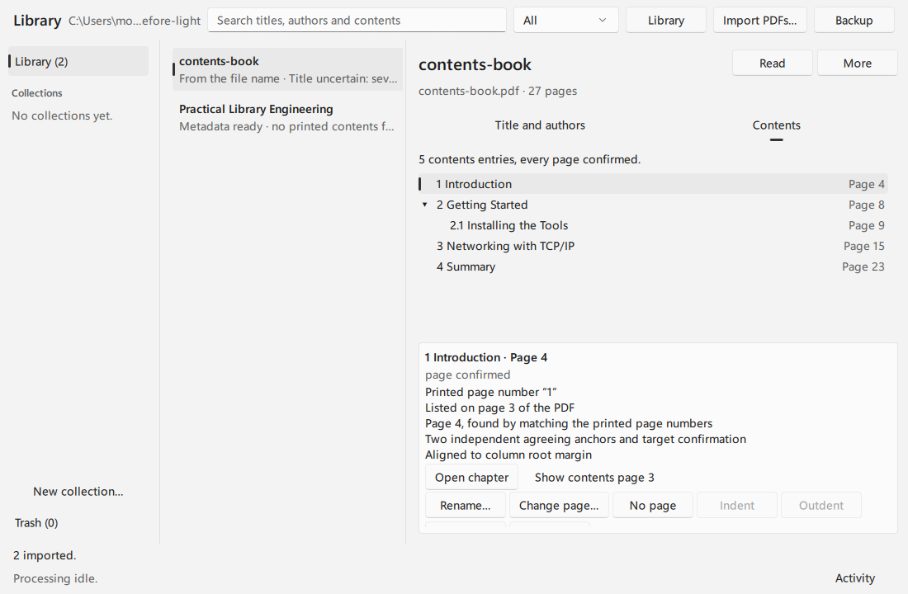 | 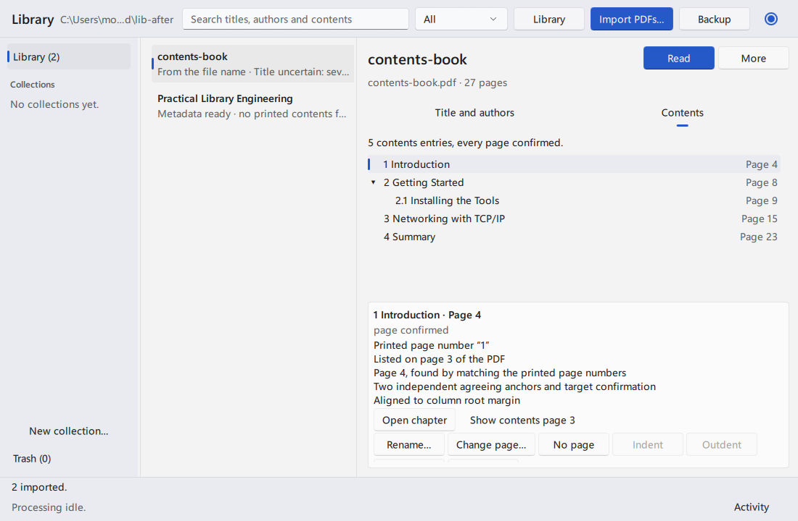 | 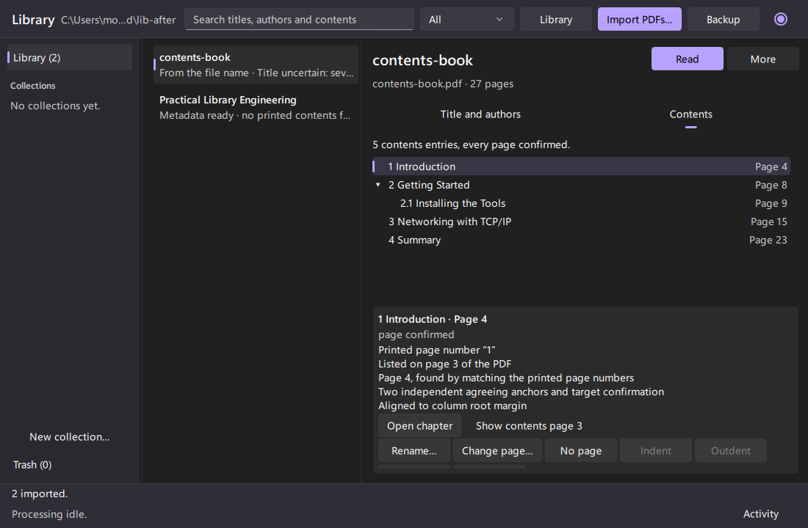 | 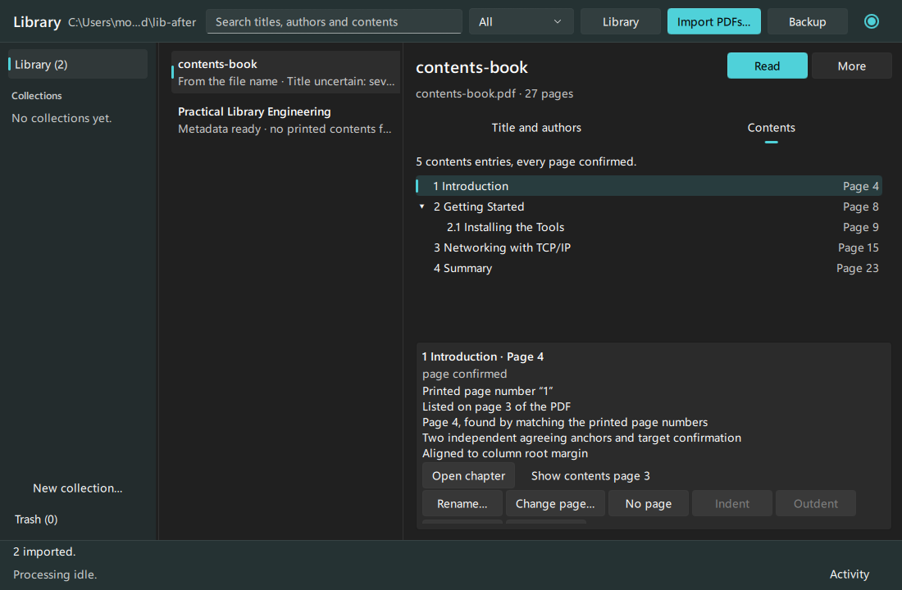 | 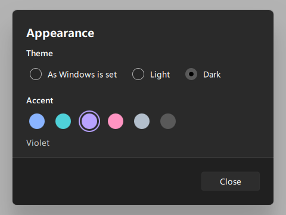 |

**`tst_appearance`** checks the presets' contrast, that choices are stored and applied to the colour scheme, that unknown stored values fall back, that `--color-scheme` and `--accent` neither read nor overwrite the stored choice (and that an unknown id is reported), and the real dialog (offscreen), including a mouse click and Space on the chosen accent. The offscreen platform ignores colour-scheme requests, so the scheme itself is asserted only where the platform applies it (`QT_QPA_PLATFORM=windows`).

**`tst_theme`** checks three things:
- the text and status colours have at least **4.5:1** contrast (WCAG 2.2 AA) on Fluent's light (`#f3f3f3`) and dark (`#202020`) window, on a card, on a selected row and on the accent-tinted surfaces, for every accent preset;
- the type ramp is ordered;
- no handwritten view sets a fixed colour, a fixed font size or `highlightedText`.

## Behaviour

- **Opening:** "Opening the library…" with a busy indicator. The result of recovering interrupted imports is shown in the status bar ("1 interrupted import completed"). If the library cannot be opened (for example it is already open in another instance), the reason is shown.
- **Import:** use "Import PDFs…" (a native file dialog for multiple PDFs) or drop files on the window.
  - Files queue and import one at a time off the GUI thread, with "n of m", a per-file progress bar and Cancel.
  - The batch summary ("2 imported, 1 already in the library.") and per-file problems (duplicates, duplicates in Trash, non-PDFs, failures) are listed under it.
  - File-dialog URLs are converted with `toLocalFile()`.
- **Processing:** every imported book gets a metadata job and a contents job, queued in the import transaction. Jobs run one at a time and start once recovery has run; a book's two jobs share one SDK call (PROCESSING.md), and its title appears before its contents analysis ends.
  - The footer shows "Reading title and authors: *book*" or "Analyzing contents: *book*", with "*n* pages read" when the SDK reports it, and "*n* books waiting", with an indeterminate busy indicator. The SDK reports no totals, so no percentage is shown.
  - **Activity** opens a panel listing each job's book, task and state ("Waiting", "Reading the first pages…", "Done", "Failed: …", "Cancelled", "Interrupted when the application closed; queued again"). It has **Cancel** for waiting and running jobs, **Retry** for failed or cancelled jobs that have no newer job, and **Cancel all**.
  - When OCR models were not found, the panel says that title pages that are scanned images cannot be read.
- **Book list:**
  - It shows the effective title, or the file name with "From the file name", and the processing state:
    - "Waiting to read title and authors" and "Reading title and authors…";
    - "Metadata ready";
    - "Title uncertain: several candidates" (ambiguous; never accepted automatically);
    - "No title found in the document";
    - "Title and authors could not be read" and "Metadata extraction cancelled";
    followed by the contents state: "contents waiting", "analyzing contents…", "*n* contents entries", "no printed contents found", "contents could not be analyzed", "contents analysis cancelled" or "contents not analyzed".
    A published result stays shown while a rerun waits, runs or fails.
  - Extracted text is rendered as plain text.
  - The selection follows the book ID across refreshes.
  - Empty state: "No books yet. Choose "Import PDFs…" or drop PDF files here."
- **Search:** a search field and a scope (All, Titles, Authors, Contents) are always in the toolbar; Ctrl+F focuses the field and Esc clears it.
  - While a query is entered, the results replace the book list; clearing it shows the book list and its selection again.
  - Search covers titles, authors and contents entries, not the full text; the field's accessible description says so.
- **Inspector:** selecting a book shows it beside the list.
  - Metadata values say where they came from: "From the document", "Your correction", "Cleared by you", "Uncertain: several candidates, none chosen" or "Not found in the pages searched". Without a value, the analysis's reason follows on its own line.
  - The contents tab summarizes coverage ("5 contents entries, every page confirmed."; "Possible contents pages were found, but the analysis could not settle on a table of contents." when the analysis reported blockers and no entries), lists what is uncertain ("No page found: 1 of 5."), and says whether a bookmarked copy could be made, with the plan's blockers.
  - Tree rows show the physical page ("Page 4", although it is printed "1"), "Page 5 or 10?" for ambiguous entries, or "Page not found". Nothing is guessed.
  - The selected entry's reasons are in plain language ("Listed on page 3 of the PDF", "Left out of the bookmarks: …"), with technical details on request.
  - The selected entry offers **Open chapter** (its physical page) and **Show contents page *n*** (the page where the contents list it). They are two different actions; an unresolved entry offers only the second.
  - **Correcting metadata (M07):** each field has **Correct**. The dialog offers Save, **Leave empty** (stays empty even if the document has a value) and **Use the document's value**. A corrected field shows "The document says: …". The **More** menu reads the title and authors or the contents again; corrections stay.
  - **Editing contents (M07):** the selected entry offers:
    - **Rename…** and **Set page…** or **Change page…** (the page as shown in the reader);
    - **No page**;
    - **Indent** (under the entry above it at its level) and **Outdent**;
    - **Add after…**;
    - **Remove**, which removes the entry and its sub-entries (kept, struck through, not searched), and **Restore**.

    Each save is a new version of the contents, and the edited entry stays selected. The entry says what you changed ("Changed by you: title, page"), and a page you set replaces the analysis's reasons.
  - **Edited contents** show a banner: "You edited these contents (version *n*). Search uses your version." with **Discard my edits…** (after confirming, the analysis is shown again).
  - **When a newer analysis finds different contents,** the edits stay shown and searched, and the banner offers **Keep my edits** or **Use the new analysis**. Nothing is reconciled automatically. The book list says "(edited; a new analysis to review)".
- **Organizing (M08):**
  - The sidebar switches the book list between the library, one collection and Trash, and the toolbar heading names the view.
  - Search covers the shown collection, or the whole library otherwise.
  - The inspector's **More** menu has **Add to collection ▸**, **Remove from "*collection*"** (in a collection view) and **Move to Trash**.
  - A book in Trash shows "In Trash" and **Restore**, and its list row says "In Trash since *date*".
  - **Moving a book to Trash** stops its running extraction at once and hides it from the library, its collections and search. **Restoring** it resumes the work the trash stopped, right away.
  - **Importing a file whose book is in Trash** offers **Restore *n* book(s) from Trash** under the import summary.
  - Collections never copy files. Deleting a collection, after confirming, keeps its books.
- **Reading:** the reader replaces the library view while a book is open, and "Library" returns.
  - A book opens where it was last read: double-click it in the list, or use **Read** in the inspector.
  - A chapter opens at its physical page ("Open chapter" in the inspector; "Open" on a search hit).
  - An entry without a confirmed page opens the page where the contents list it ("Show contents page", or "Contents page" on a search hit). No page is guessed.
  - The position is saved per book and survives a restart.
- **Saving a copy with bookmarks (M09):** **More → Save a copy with bookmarks…** opens the Export dialog.
  - Before anything is written, it says how many bookmarks the copy gets, and lists every contents entry left out (no confirmed page) or placed at another level, with the reason. The book in the library is never changed.
  - **Save copy** writes a new PDF in the background: "Waiting for the current work to finish…" while an analysis runs, then "Writing the bookmarked copy…", then "Saved as …, with *n* bookmarks".
  - An existing file is replaced only after **Replace**, and only if it is still the same file when the copy is written (PROCESSING.md, "Export jobs"). The library folder, the book's own PDF and imported originals are refused with the reason.
  - A book in Trash, or one whose contents are not analyzed yet, shows why it cannot be exported.
- **Backup and restore (M10):** **Backup → Back up the library…** saves the catalog and every book's PDF into a new, verified folder "MyBooksLibrary backup *date time*", while you keep working. **Backup → Restore a backup…** checks a backup and restores it as a **new** library, never over the open one. It never goes inside the open library's folder, and a copy with bookmarks that was still waiting is not carried over. **Open restored library** starts it in a new window.
- **Another library (issue #30):**
  - **Library → Open library…** chooses a folder, then **New window** or **Instead of this library**. Another library always runs in its own process (DECISIONS.md); "instead" then closes this window as its close button does, stopping work first.
  - The folder must be an existing library. A folder that is not one, a backup, or the library already open here is refused with the reason, and the app never creates a library in a chosen folder.
  - **Library → Open the default library** starts the default one.
  - The **Library** menu stays enabled when this window's library could not be opened: the window then shows the reason, with the same two commands.
  - The title names the library, and the toolbar's path has a tooltip with the whole path and how the library was chosen (default, `--library`, `MYBOOKSLIBRARY_ROOT`, or "the library you opened last").
  - **The next start** opens the library last opened from the app (Open library…, Open the default library, Open restored library), once it had opened. A `--library` shortcut does not change it. A remembered library that cannot be opened any more shows the reason with the same two commands, and is never made again in its old place.
- **Closing:** closing while work runs calls `prepareToClose()`, which cancels imports and **stops** processing. Stopping is not cancelling: the running extraction is interrupted and requeued, and waiting jobs stay queued, so the next start continues them. The window shows "Finishing before closing…" and closes when the controller is idle. There is no blocking wait on the GUI thread. The SDK stops at its next checkpoint, so an OCR page in progress finishes first: closing took 6.8 s during OCR of `image-only.pdf` in Release.

## Not yet

A list of all saved copies of a book (the dialog shows the last one), comparing a newer analysis with the edited contents entry by entry, browsing earlier versions of the contents, emptying Trash (permanent deletion), selecting several books at once, and keyboard shortcuts beyond list navigation.

## Screenshots (Release build, `--screenshot`, library at `C:\MBL-demo\Library`)

Empty library:

After importing two PDFs and a duplicate:

After importing the three test PDFs with the real SDK and OCR models (`--activity` shows the panel). "Title uncertain" means the SDK reported several candidates:

After M05 part 1, with the same three test PDFs: each book shows its metadata state and its contents state, and each has a "Title and authors" and a "Contents" job, served by one SDK call:

The inspector's Contents tab after importing `contents-book.pdf` (Release, real SDK, `--inspect-first`):

The Contents tab with an entry selected: its reasons, Open chapter and Show contents page, and the edit actions. Indent and Outdent are unavailable for the first top-level entry (Release, real SDK, `--inspect-first`, library at `C:\MBL-demo-Contents`):

The window with the sidebar (Release, real SDK, `--inspect-first`, library at `C:\MBL-demo-Contents`):

The Export dialog for `contents-book.pdf` imported as "Βιβλίο", with an example destination (`tst_exportcontroller`, real SDK, `MBL_SCREENSHOT_DIR`):

The Back up dialog, with an example folder (`tst_backupcontroller`, `MBL_SCREENSHOT_DIR`):

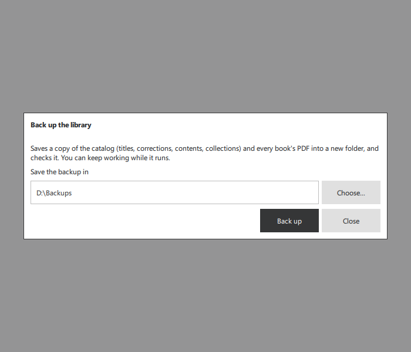

Open library…, at the window's minimum size, with an example folder (`tst_libraryswitcher`, `MBL_SCREENSHOT_DIR`):

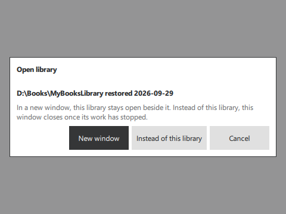

A library that could not be opened: the reason, and a way out (Release, `--library "D:\Books\My library" --existing-library`, a folder that does not exist):

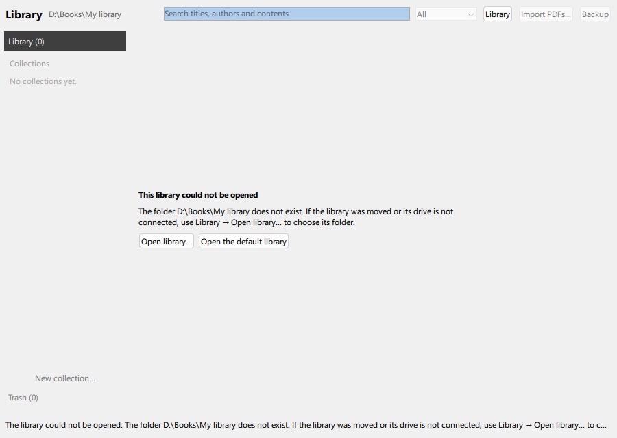

Searching "tcp/ip" after importing the three test PDFs: a contents-only match, with its physical page (Release, real SDK, `--search tcp/ip --inspect-first`):

The reader after "Open chapter" on "3 Networking with TCP/IP": physical page 15, whose printed page number is 12 (Release, `--read-page 15`):

