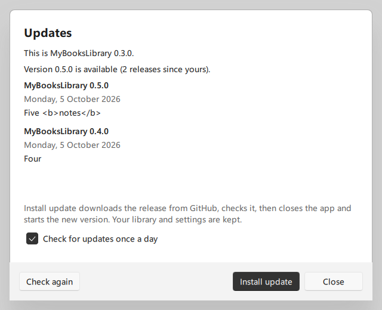

# Releases and in-app updates

Modelled on repo-watch's in-app updates ([PantaKoda/repo-watch@fdfe02f](https://github.com/PantaKoda/repo-watch/commit/fdfe02fe63a631205f4d3d3a7b1a33de33d2e7bc)). Releases are made as before (RELEASING.md); the app finds them on the repository's Releases page and installs one when the user asks.

## For maintainers

Nothing changes in how a release is cut (RELEASING.md): a release PR (version and notes), then a `vX.Y.Z` tag on `main`, and the Release workflow publishes `MyBooksLibrary-X.Y.Z-win64.zip` with its `.sha256`. What the app needs from a release:

- **Public repository**, so the app reads releases without signing in and anyone can download them.
- **Published, not draft or pre-release**, with a `vX.Y.Z` tag. Other tags are ignored.
- **Both assets at the repository's own download URLs:** `https://github.com/PantaKoda/MyBooksLibrary/releases/download/vX.Y.Z/MyBooksLibrary-X.Y.Z-win64.zip` and `….zip.sha256`. The workflow uploads them that way.
- **`release.json` in the zip**, next to the executable: `{"product": "MyBooksLibrary", "version": "X.Y.Z"}`. `package.ps1` writes it. The app installs a package only if this marker names exactly the release's version.
- **The release notes** (`docs/releases/vX.Y.Z.md` plus GitHub's PR list) are the text the update window shows, as plain text.

The repository is `MBL_UPDATE_REPOSITORY` in CMake (default `PantaKoda/MyBooksLibrary`).

**Releases before 0.4.0** (0.1.0–0.3.0) have no update check and no marker. Their users update by hand once: download the new zip, close the app, and replace the app's folder. From then on, the app updates itself.

## For users: how updates work

- **Checking:** once a day (the first check 30 seconds after the app starts), and whenever you choose **Library → Check for updates…**. The app asks GitHub's API for the releases anonymously: no account and no token. "Check for updates once a day" in the Updates window turns the daily check off.
- **Update button:** when a newer release exists, an **Update to X.Y.Z** button appears in the toolbar. It opens the Updates window with the notes of every release since your version, newest first.
- **Install update** (only when you click it):
  1. Downloads the `.sha256` file, then the zip, only from the repository's release URLs on github.com and GitHub's download hosts (`*.githubusercontent.com`), over HTTPS. Any other address, redirects included, is refused. A download that receives nothing for 30 seconds stops; **Cancel** stops it at any time. Either way nothing has changed, and installing can be tried again.
  2. Checks the zip's SHA-256 against the published checksum. On a mismatch nothing is unpacked.
  3. Unpacks it with Windows' own `tar.exe` into `%LOCALAPPDATA%\MyBooksLibrary\MyBooksLibrary\updates\X.Y.Z\`. Then it checks two things, with a separate message for each: that the layout is right (`MyBooksLibrary\appMyBooksLibrary.exe`), and that `release.json` names exactly that version.
  4. Starts the new copy from the updates folder while the window is still open. If it cannot be started (for example an antivirus quarantined it), the Updates window says so and nothing else happens. Otherwise the window closes the usual way: running work stops first and resumes after the restart.
  5. The new copy waits for the app to exit, for up to 10 minutes, since closing waits for an OCR page in progress. Then it swaps the folders:
     - sets an older `<folder>.previous` aside;
     - renames the app's folder to `<folder>.previous`;
     - copies itself into the app's folder;
     - deletes the set-aside older version, but only now.

     Then it starts the new version. On the library the window had, if a plain start would open a different one (`--library`); otherwise as a plain start, so the library keeps its "default" or "remembered" label. The new version says "Updated from … to …" and removes the downloads.
  6. **If the app's folder is in use** (another MyBooksLibrary window is open), nothing changes, and the older `.previous` stays where it was. **If copying fails part-way**, the previous version and the older `.previous` are put back. Either way, the previous version starts again and says why the update could not be installed. Every step is written to `updates\update.log`.
- **What is kept:** your libraries, settings (theme, accent, last library) and the update log are outside the app's folder. **An update never moves or deletes a library:** the app checks for one before downloading, and the new copy checks again before it touches anything. Other files you keep inside the app's folder move to `.previous` with it, and are deleted by the update after that. Keep nothing of yours there.
- **Rolling back:** close the app, delete the app's folder, and rename `<folder>.previous` back. The previous version stays until the next update.
- **When the app cannot update itself**, the Updates window says why and offers **Open release page** instead:
  - a copy built from source (no `release.json`), or one whose marker does not match the running version;
  - **any library inside the app's folder**, whether it is open or not (a `library.sqlite` at any depth), or the updates folder inside it. An example is the zip unpacked into `%LOCALAPPDATA%\MyBooksLibrary\MyBooksLibrary` itself. Move the app's folder, or the library, elsewhere first. Otherwise one update would move the library to `.previous`, and the next would delete it;
  - a `<folder>.previous` that holds anything but a previous release, such as a library or the user's own files;
  - a folder holding the app that cannot be written (for example under `C:\Program Files` without administrator rights).

*The Updates window (FluentWinUI3, from `tst_updatecontroller` with `MBL_SCREENSHOT_DIR`): two releases since 0.3.0, their notes as plain text, and Install update.*

## Security notes

- **The checksum** proves the download is the file published with the release, and **HTTPS** from GitHub proves it came from GitHub. Neither is a **code signature**: someone able to publish a release on the repository could publish a harmful one. Signing the executable (Authenticode) and signed update metadata remain future work.
- **HTTPS uses Windows' own TLS (Schannel).** The package ships no OpenSSL; `--tls-check` reports the backend, and `package.ps1` requires Schannel.
- **Release notes are untrusted text**, shown as plain text, never rendered as markup.
- **No credentials:** checks and downloads are anonymous. A daily check stays far below GitHub's 60 anonymous requests per hour; a refusal for too many requests is reported as such.
- **Unpacking:** Windows' `tar.exe` refuses absolute paths and `..` in a zip. The unpacked copy is checked before it may run.

## Code

| Part | Where | What |
| --- | --- | --- |
| Releases | `src/update/releases.*` | Versions; GitHub's release list parsed and filtered (drafts, pre-releases, other tags and assets at other URLs ignored); `.sha256` files |
| Install checks | `src/update/installinfo.*` | `release.json`; may this copy replace itself (`checkInstall`) |
| Download | `src/update/updatedownloader.*` | Checksum, streamed download with hashing, stall timeout, cancel, trusted hosts and redirects, unpacking and checking |
| Hand-over | `src/update/updateapplier.*` | `--apply-update`: wait for the old app, swap the folders with `.previous`, restore on failure, restart |
| Controller | `src/presentation/updatecontroller.*` | Daily and manual checks, state and notes for QML, install, the hand-over after the event loop, notices after an update |
| Window | `qml/update/UpdateDialog.qml`, `Main.qml` | The Updates window, the toolbar's Update button, Library → Check for updates…, the notice in the status bar |

**Development modes never check:** any development option (`--import`, `--screenshot`, `--close`, …) turns off the automatic check, so smoke runs and screenshots never reach the network.

## Tests

- `tst_releases`: versions, filtering, asset URLs (other host, repository or tag, HTTP, queries, `..`, user info, ports), `.sha256` formats, trusted hosts.
- `tst_updateinstall`: the marker, `checkInstall` (source build, other version, library inside the app's folder, even before it exists), a swap with `.previous` kept and an older one replaced, folders that are not releases, a file in use (nothing changes) and a failed copy (the previous version put back). Windows file locks stand in for another running window.
- `tst_updatedownloader`: real zips made by `tar.exe`, served as local files: success, checksum mismatch, a package of another version, non-GitHub addresses, cancel.
- `tst_updatecontroller`: checks against a local copy of GitHub's answer (newer releases with notes, up to date, a failed check, a source build, a library inside the app's folder), the daily setting, the notices after an update, and the real Updates window.
- `package.ps1`: `--tls-check` must use Schannel, and the hand-over runs with the packaged binaries. A copy marked as the next version replaces a trial folder, `.previous` is kept, and the new version starts.

**Not tested automatically:** a download from github.com itself. The first release with this feature can only be updated *to* by a later one.
